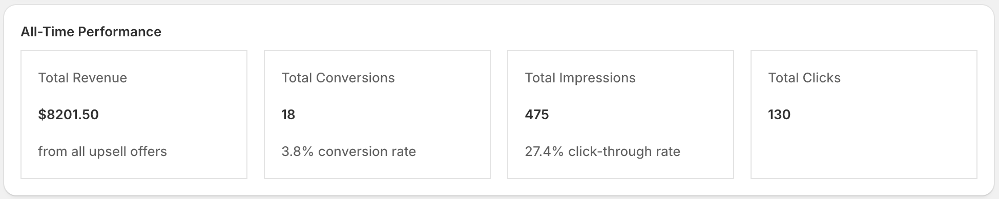
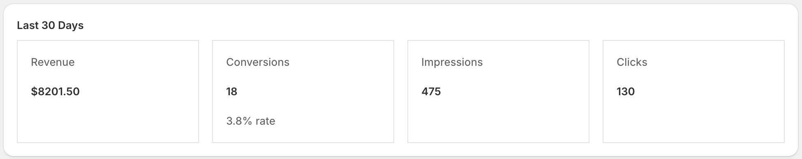
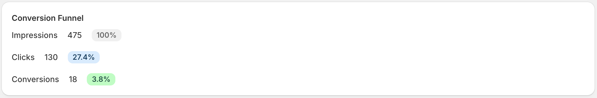
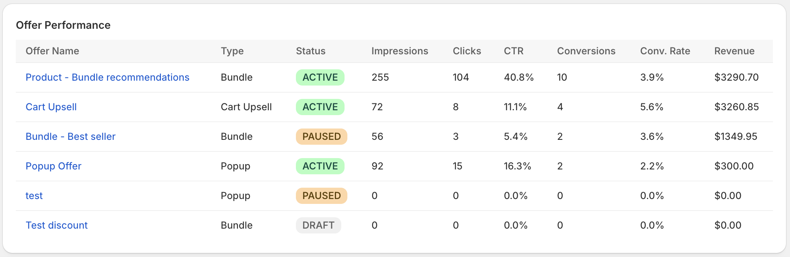
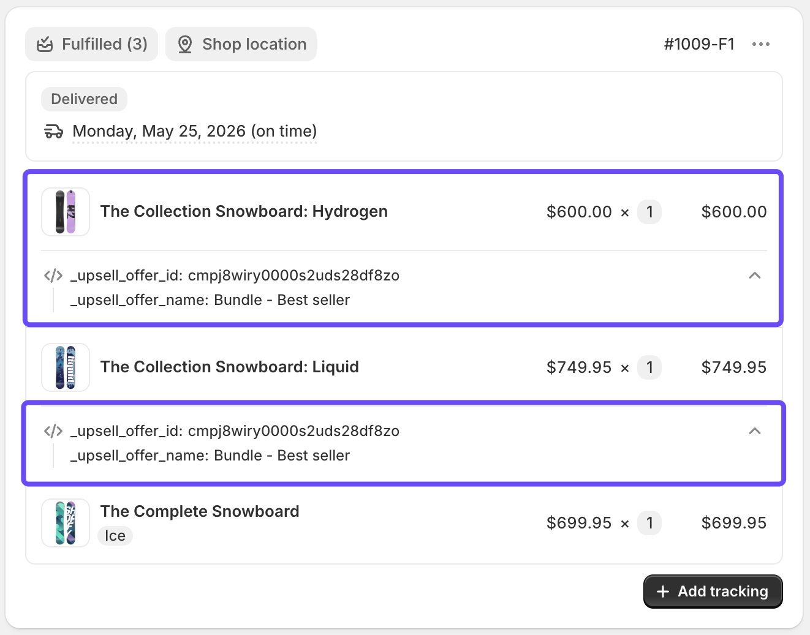

[← Back to Home](index)

---

# Analytics

* TOC
{:toc}

---

## Overview

The Analytics page gives you a full picture of how your upsell and cross-sell offers are performing, from the first impression to the final purchase.

---

## Date Range Filter

Use the **7 Days**, **30 Days**, or **90 Days** buttons in the top-right corner to change the reporting window for the "Recent Period" metrics. The default is **30 days**.

---

## All-Time Performance

The top grid shows cumulative totals across the entire lifetime of your app:

| Metric | Description |
|--------|-------------|
| **Total Revenue** | Total revenue generated from upsell conversions |
| **Total Conversions** | Number of times a recommended product was purchased, plus the overall conversion rate (Conversions ÷ Impressions) |
| **Total Impressions** | Total times any offer was displayed, plus the overall click-through rate (Clicks ÷ Impressions) |
| **Total Clicks** | Total times a customer clicked on a recommended product |



---

## Recent Period Performance

The second grid shows the same four metrics filtered to the selected date range (7, 30, or 90 days).

This is useful for:
- Monitoring month-over-month trends
- Evaluating the impact of a new offer or discount
- Spotting sudden drops in performance



---

## Conversion Funnel

> Only shown when there is at least one impression.

The funnel visualizes how customers move through each stage:

```
Impressions (100%)
     ↓
  Clicks (X%)
     ↓
Conversions (X%)
```

Each stage shows its percentage relative to impressions. Use this to identify where customers drop off:
- **Low click-through rate** → Your offer title, product selection, or placement needs improvement
- **Low conversion rate** → Your pricing, discount, or product relevance needs improvement



---

## Offer Performance Table

The table at the bottom ranks all your offers by revenue (highest first) and shows:

| Column | Description |
|--------|-------------|
| **Offer Name** | Clickable link to the offer edit page |
| **Type** | BUNDLE, POPUP, or CART_UPSELL |
| **Status** | ACTIVE, PAUSED, or DRAFT |
| **Impressions** | Times this offer was displayed |
| **Clicks** | Times a product in this offer was clicked |
| **CTR %** | Click-through rate (Clicks ÷ Impressions) |
| **Conversions** | Times a product from this offer was purchased |
| **Conv. Rate %** | Conversion rate (Conversions ÷ Impressions) |
| **Revenue** | Total revenue attributed to this offer |



---

## Recently Viewed Block Analytics

The Analytics page includes a **separate section** specifically for the **Recently Viewed Products** block. This section only appears once there is at least one impression or conversion attributed to that block.

> This section is independent from the Upsell Offers Analytics above — each has its own all-time totals and recent-period metrics.

### Metrics shown

The Recently Viewed section displays the same four core metrics as the main analytics, but scoped exclusively to interactions with the Recently Viewed Products block:

| Metric | Description |
|--------|-------------|
| **Revenue** | Revenue from orders that included a recently viewed product (all-time and last N days) |
| **Conversions** | Times a recently viewed product was purchased, plus conversion rate |
| **Impressions** | Times the Recently Viewed block was rendered with at least one product card |
| **Clicks** | Times a customer clicked "Add to cart" on a recently viewed product |

Both an **All-Time** and a **Last N Days** grid are shown, with the date range controlled by the same 7 / 30 / 90 day filter that applies to the main analytics section.

### How Recently Viewed analytics are separated

Events from the Recently Viewed block are stored with `blockType: "RECENTLY_VIEWED"` in the database, which keeps them completely separate from offer events (`blockType: null`). This means:

- Totals in the **Upsell Offers Analytics** section never include Recently Viewed interactions
- Totals in the **Recently Viewed Block Analytics** section are purely from that block
- Billing cycle revenue includes both (all storefront revenue attributed to the app counts toward your plan limit)

---

## How Conversions Are Tracked

### Upsell offers

1. **Frontend tracking** — When a customer clicks the CTA and adds a product to cart, the widget sends a tracking event with the `_upsell_offer_id` line item property.
2. **Order webhook** — When an order is paid, the app checks each line item for a `_upsell_offer_id` property. If present, a conversion is recorded server-side.

### Recently Viewed Products block

Conversions for the Recently Viewed block use the same webhook mechanism, but the line item property is `_upsell_block` with value `RECENTLY_VIEWED` instead of an offer ID. This allows the app to attribute the order revenue to the block independently.

The webhook-based tracking is the more reliable method and prevents double-counting across all block types.

---

## Checking Revenue from Individual Orders

You can verify exactly which orders were influenced by an upsell offer or the Recently Viewed block by inspecting the line item properties directly in Shopify.

### Steps

1. In your Shopify admin, go to **Orders**.
2. Click on any order you want to inspect.
3. In the order detail page, find the list of purchased line items.
4. Click **Show details** (or expand the line item if it is collapsed) to reveal the **line item properties** attached to that item.

### What to look for

The app writes one of two properties to each line item that was added through a widget:

| Property | Value | Meaning |
|----------|-------|---------|
| `_upsell_offer_id` | An offer ID (e.g. `cm4x...`) | This item was added via an **Upsell Offer** widget. The value is the internal ID of the offer that triggered the purchase. |
| `_upsell_block` | `RECENTLY_VIEWED` | This item was added via the **Recently Viewed Products** block. |

Line items purchased through normal browsing (not via a widget) will have **neither property** — they do not appear in the app's analytics.

> **Note:** Properties whose names start with `_` (underscore) are hidden from customers on the storefront and in order confirmation emails. They are only visible to you in the Shopify admin.

### Example

An order contains two items:

| Product | Line Item Properties |
|---------|---------------------|
| Blue T-Shirt (L) | `_upsell_offer_id: cm4xk9p2g0000...` |
| Black Hoodie (M) | `_upsell_block: RECENTLY_VIEWED` |
| White Sneakers (42) | *(none)* |

In this example:
- The **Blue T-Shirt** was added via an upsell offer — you can look up that offer ID in the [Offers list](../offers) to confirm which offer converted.
- The **Black Hoodie** was added via the Recently Viewed Products block.
- The **White Sneakers** were added through regular browsing and are not attributed to the app.

### Cross-referencing with Analytics

The offer ID in `_upsell_offer_id` corresponds to the offer shown in the **Offer Performance** table on the Analytics page. You can use it to confirm that the Analytics revenue figures match the orders you see in Shopify.




---

## Analytics Tips

- **Best performing offer types** are typically Cart Upsell (high intent, near checkout) followed by Bundle (high visibility on product pages).
- **AI recommendations** tend to improve CTR over time as they surface contextually relevant products.
- **Offers with discounts** generally show higher conversion rates — test 10–15% off to see the uplift.
- Check analytics weekly to identify underperforming offers and either improve them or pause them.

---

## Revenue and Billing Cycles

> Analytics revenue is distinct from your **billing cycle revenue**.

- **Analytics revenue** = all-time (or period) revenue shown on the Analytics page
- **Billing cycle revenue** = revenue generated in the current 30-day billing period, used to enforce plan limits

Your billing cycle resets every 30 days. See [Billing Plans](billing) for details on plan limits.

---

[← Back to Home](index)
