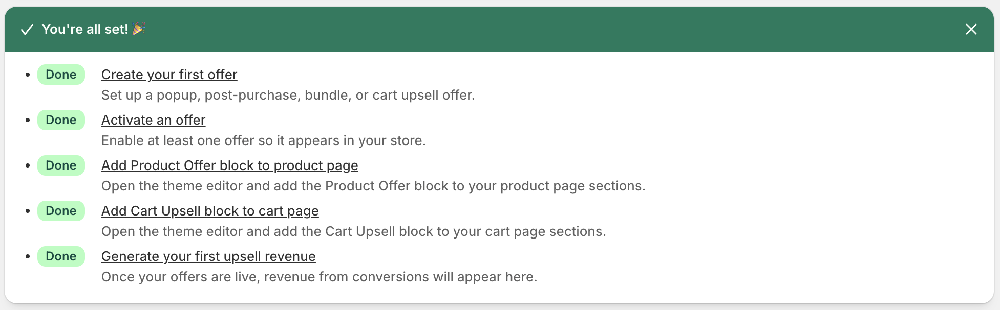
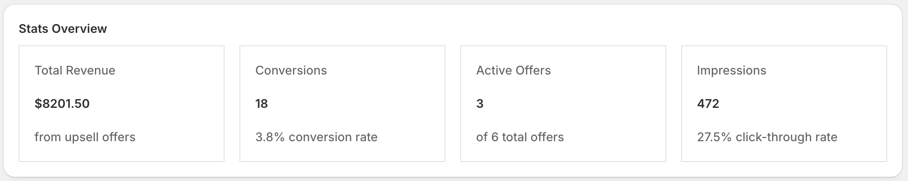
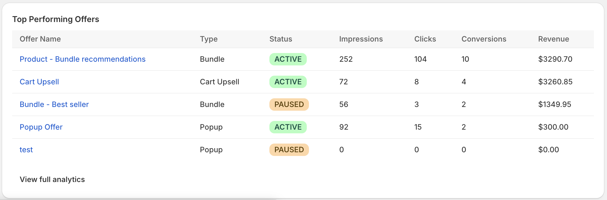
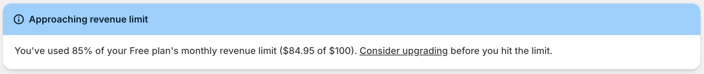
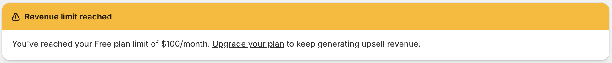
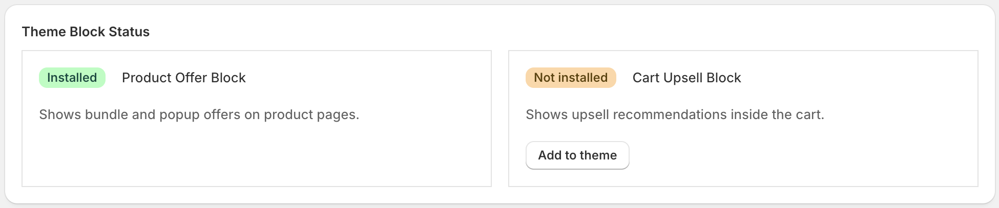

[← Back to Home](index)

---

# Getting Started

* TOC
{:toc}

---

## Installation

1. Install **Ultimate Upsell & Cross Sell** from the [Shopify App Store](https://apps.shopify.com/ultimate-upsell-cross-sell){:target="_blank"}.
2. You will be redirected to the Shopify admin to grant permissions. The app requires:
   - `read_products`, `write_products` — to fetch and display product data
   - `read_orders`, `read_customers` — to track conversions
   - `write_discounts`, `read_discounts` — to apply discount codes
   - `read_all_orders` - to fetch best-selling products
   - `write_metaobjects`, `write_metaobject_definitions` — to store offer metadata
3. After granting permissions, you are taken to the app **Dashboard**.

---

## Onboarding Checklist

The Dashboard displays a 5-step onboarding guide. Complete all steps to start generating upsell revenue.

| Step | Action | Where |
|------|--------|--------|
| 1 | Create your first offer | Offers → New Offer |
| 2 | Activate an offer | Set status to **Active** |
| 3 | Add the **Product Offer** block to a product page template | Theme Editor |
| 4 | Add the **Cart Upsell** block to your cart page template | Theme Editor |
| 5 | Generate your first upsell revenue | — |

Progress is displayed as a completion percentage.

---

## Dashboard Overview

The Dashboard (`/app`) is your home screen and shows:

### Stats Grid

Four key metrics for your store (all-time):
- **Total Revenue** — Revenue generated from upsell conversions
- **Conversions** — Number of upsell products purchased
- **Active Offers** — Count of currently active offers
- **Impressions** — Total times offers have been shown

### Top Performing Offers

A table of your 5 highest-revenue offers showing name, type, status, impressions, clicks, conversions, and revenue.

### Plan Usage

If you are on a paid plan, the dashboard shows:
- Your current plan name
- Revenue generated this billing cycle vs. the plan limit
- A **warning banner** at 80% usage
- A **critical banner** when the limit is reached

> **What happens when the limit is reached?** Offers are automatically hidden from your storefront. They resume showing when your billing cycle resets (every 30 days) or when you upgrade your plan.

### Theme Block Status

The dashboard detects whether the app's theme blocks are installed in your active theme. If blocks are missing, a banner appears with a direct link to the Theme Editor for the relevant template (product or cart page).

---

## What's Next?

- [Create your first offer](offers/create)
- [Add theme blocks to your storefront](theme-blocks)
- [Understand billing plans and limits](billing)

---

[← Back to Home](index)
