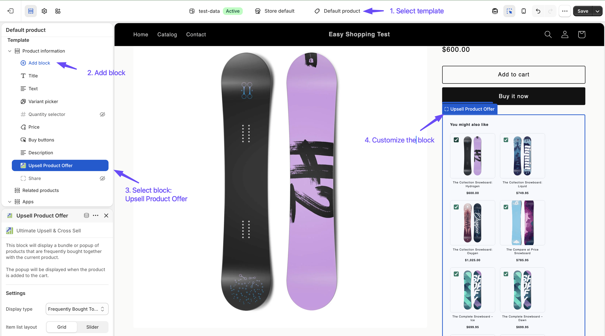
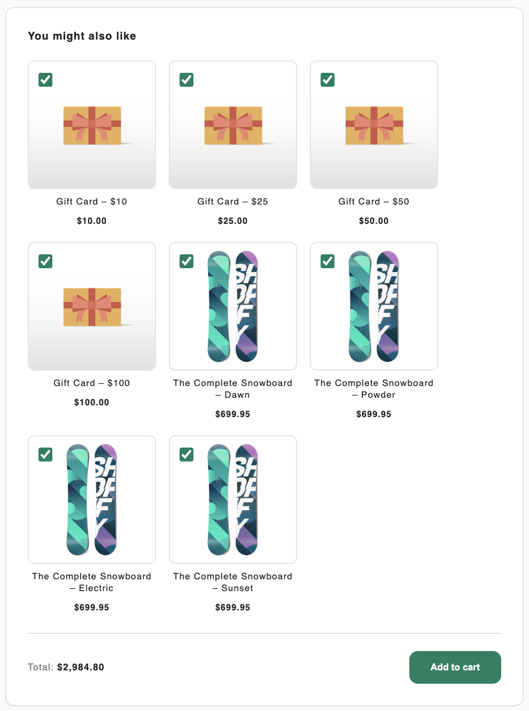
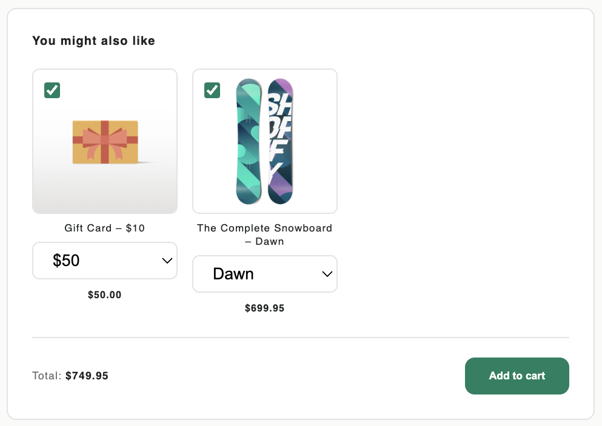

[← Back to Home](index)

---

# Theme Blocks

* TOC
{:toc}

---

## Overview

The app uses **Shopify Theme App Blocks** to render offer widgets on your storefront. Theme blocks must be manually added to your theme via the Theme Editor before any offers will appear to customers.

There are three blocks:

| Block | Purpose | Supported Templates |
|-------|---------|---------------------|
| **Product Offer** | Renders Bundle and Popup offers | Product page (`product.json`) |
| **Cart Upsell** | Renders Cart Upsell offers | Cart page (`cart.json`) |
| **Recently Viewed Products** | Shows products the customer recently browsed | Product, Collection, Homepage, Page |

> **Important:** Even if your offers are set to **Active**, they will not appear on your storefront until the corresponding theme block is installed.

---

## Adding the Product Offer Block

The Product Offer block displays Bundle and Popup offers on your product pages.

### Steps

1. From your Shopify admin, go to **Online Store → Themes**.
2. Next to your active theme, click **Customize**.
3. In the top center dropdown, select **Products → Default product** (or whichever template your products use).
4. In the left sidebar, click **Add section** or **Add block** (depending on your theme structure).
5. Search for **"Ultimate Upsell"** or scroll to find **Product Offer** under the app blocks section.
6. Click the block to add it and position it where you want offers to appear (e.g., below the product description or add-to-cart button).
7. Click **Save**.

> **Tip:** The Dashboard detects whether this block is installed. If missing, a banner will appear with a direct link to the Theme Editor.

---

## Adding the Cart Upsell Block

The Cart Upsell block displays Cart Upsell offers on your cart page.

### Steps

1. From your Shopify admin, go to **Online Store → Themes**.
2. Next to your active theme, click **Customize**.
3. In the top center dropdown, select **Cart** (or the template that shows your cart page).
4. In the left sidebar, click **Add section** or **Add block**.
5. Search for **"Ultimate Upsell"** or scroll to find **Cart Upsell** under the app blocks section.
6. Click the block to add it and position it above or below the checkout button.
7. Click **Save**.

---

## Adding the Recently Viewed Products Block

The Recently Viewed Products block shows a personalized list of products the customer has browsed on your store. Products are saved in the browser's local storage — no login required — and the block re-renders automatically as the history grows.

This block operates independently from your upsell offers and does not require any offer to be configured or active.

### Supported templates

Unlike the other two blocks, **Recently Viewed Products** can be placed on multiple template types:

- **Product** pages — show other products viewed during the same session
- **Collection** pages — remind shoppers of products they explored before
- **Homepage** (`index`) — surface recently browsed products for returning visitors
- **Custom pages** (`page`) — suitable for dedicated "Your history" or wishlist-style pages

### Steps

1. From your Shopify admin, go to **Online Store → Themes**.
2. Next to your active theme, click **Customize**.
3. In the top center dropdown, select the template you want to add the block to (e.g., **Products → Default product**).
4. In the left sidebar, click **Add section** or **Add block**.
5. Search for **"Recently Viewed"** or scroll to find **Recently Viewed Products** under the app blocks section.
6. Click the block to add it and position it on the page.
7. Click **Save**.

> **Tip:** Adding this block to the Homepage is especially effective for returning visitors — customers who came back to buy will immediately see the products they browsed before.

---

## Block Settings

Once a block is added, you can configure it directly in the Theme Editor. Click the block in the sidebar or on the canvas to see its settings.

### Product Offer Block Settings

| Setting | Options | Description |
|---------|---------|-------------|
| **Display Type** | Bundle / Popup | Choose whether to show Bundle or Popup offers from this block instance |
| **Item List Layout** | Grid / Slider | How recommended products are arranged (Bundle only) |
| **Check All Items by Default** | Yes / No | Whether all bundle items are pre-checked (Bundle only) |
| **Show Plus Icon** | Yes / No | Show the "+" separator between bundle item cards (Bundle only) |
| **Variant Display** | Separated / Grouped by product | How product variants are presented — see [Variant Display](#variant-display) |
| **Block Max Width** | 300–1400 px | Maximum width of the offer widget |
| **Button Color** | Color picker | Background color of the Add to Cart buttons |

### Cart Upsell Block Settings

| Setting | Options | Description |
|---------|---------|-------------|
| **Item List Layout** | Grid / Slider | How recommended products are arranged |
| **Variant Display** | Separated / Grouped by product | How product variants are presented — see [Variant Display](#variant-display) |
| **Block Max Width** | 300–1400 px | Maximum width of the offer widget |
| **Button Color** | Color picker | Background color of the Add to Cart buttons |

### Recently Viewed Products Block Settings

| Setting | Options / Range | Default | Description |
|---------|----------------|---------|-------------|
| **Heading** | Text | "Recently Viewed" | Section heading displayed above the product cards |
| **Button text** | Text | "Add to cart" | Label for the Add to Cart button on each card |
| **Maximum products to show** | 2–10 | 4 | Cap on how many recently viewed products are displayed; older entries are dropped once the limit is reached |
| **Layout** | Grid / Slider | Grid | Grid shows all cards in a responsive grid; Slider shows them in a horizontally scrollable carousel |
| **Block max width** | 300–1400 px | 1200 px | Maximum width of the block container |
| **Button color** | Color picker | #008060 | Background color of the Add to Cart buttons |

---

## Variant Display

The **Variant Display** setting controls how product variants appear inside offer widgets. It is available on both the **Product Offer** and **Cart Upsell** blocks.

### Separated items (default)

Each variant is shown as its **own individual card**.

- A product with 3 variants (e.g., Small, Medium, Large) appears as **3 separate cards**, one for each variant.
- The customer clicks the card they want and adds it directly — no dropdown required.
- Best suited for offers where you have carefully curated which specific variants to recommend.

### Grouped by product

All variants of the same product are **merged into a single card** with a variant dropdown selector.

- A product with 3 variants appears as **1 card** with a `<select>` dropdown listing all available variants.
- When the customer changes the dropdown, the displayed price updates automatically to reflect the selected variant's price (including any active discount).
- The first available variant is pre-selected by default.
- Best suited for offers where customers should be able to choose their preferred size, color, or style.

### When to use each mode

| Scenario | Recommended Mode |
|----------|-----------------|
| Recommending specific variants (e.g., only "Black L") | **Separated** |
| Recommending a product and letting customers pick their size/color | **Grouped by product** |
| Offer contains many variants and card grid looks cluttered | **Grouped by product** |
| Offer contains carefully selected single variants | **Separated** |

> **Note:** The Grouped mode respects variant availability. Unavailable variants are shown in the dropdown with "(Unavailable)" appended and cannot be added to the cart.

| Separated Items mode                                            | Grouped by Product mode |
|-----------------------------------------------------------------|-------------------------|
|  |  |

---

## Recently Viewed Products & Analytics

The Recently Viewed Products block tracks its own impressions, clicks, and conversions **separately** from your upsell offers. You can view its performance in the **Recently Viewed Block Analytics** section at the bottom of the [Analytics](analytics) page.

- **Impression** — recorded each time the block renders with at least one product card
- **Click** — recorded when a customer clicks "Add to cart" on a recently viewed product
- **Conversion** — recorded via the `orders/paid` webhook when a purchased line item contains the `_upsell_block: RECENTLY_VIEWED` property

> Revenue from Recently Viewed conversions **does count** toward your billing cycle revenue limit, the same as offer conversions.

---

## Multiple Block Instances

You can add **multiple instances** of the same block to a template. For example, you could add two Product Offer blocks — one for Bundles (above the description) and one for Popups (at the bottom of the page).

Each block instance will independently query for offers matching its configured display type.

---

## Switching Themes

If you switch to a different theme, you will need to re-add the app blocks to the new theme. The Dashboard will detect that blocks are missing and show a banner with links to the Theme Editor.

---

## Troubleshooting

**Offers are not showing on my storefront**

Check the following:
1. The correct theme block is installed on the relevant template.
2. At least one offer is set to **Active**.
3. The offer's trigger conditions match the current page (e.g., a "Specific Products" offer will only show on the trigger product's page).
4. Your billing cycle revenue has not reached the plan limit. See [Billing Plans](billing).
5. The global offer disable switch is not enabled in [Settings](settings).

**The block shows but no products appear**

- For **Manual** recommendations, ensure products are selected and available in your store.
- For **AI** recommendations, ensure there are products in your store with matching tags or collections.
- Check that the recommended products are published and available for sale.

---

[← Back to Home](index)
